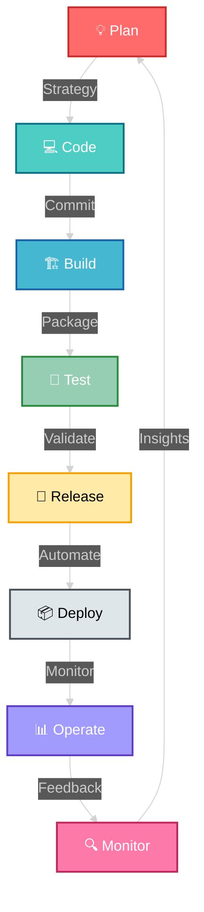

<div align="center">

<!-- Dynamic Typing Animation -->


</div>

---

<div align="center">

## 🌐 System.Initialize("DevOps_Engineer")

```typescript
class CloudArchitect {
    constructor() {
        this.name = "Yousfi Mohamed Amine";
        this.location = "Tunisia 🇹🇳";
        this.role = "Cloud DevOps Engineer";
        this.mindset = "Automate Everything";
        this.status = "Building the Future";
    }
    
    getDailyRoutine() {
        return [
            "☕ Coffee++",
            "🐳 Docker containers spinning",
            "☸️ Kubernetes clusters scaling", 
            "🚀 Pipelines deploying",
            "📊 Metrics monitoring",
            "🔁 Repeat()"
        ];
    }
}
```

</div>

---

<div align="center">

## ⚡ Current Status


</div>

---

<div align="center">

## 🎯 Skill Matrix

<table>
<tr>
<td width="50%" valign="top">

### ☁️ Cloud Native Stack

```yaml
platforms:
  primary: AWS ⭐⭐⭐⭐⭐
  secondary: 
    - Azure ⭐⭐⭐⭐
    - GCP ⭐⭐⭐
    
infrastructure:
  - Terraform
  - CloudFormation
  - Ansible
  - Pulumi

philosophy: "Cattle, not Pets 🐄"
```

</td>
<td width="50%" valign="top">

### 🐳 Container Ecosystem

```yaml
orchestration:
  - Kubernetes ⭐⭐⭐⭐⭐
  - Docker Swarm ⭐⭐⭐⭐
  - Helm Charts
  - ArgoCD
  
monitoring:
  - Prometheus
  - Grafana
  - ELK Stack
  
motto: "If it builds, ship it! 🚢"
```

</td>
</tr>

<tr>
<td width="50%" valign="top">

### 🔄 CI/CD Pipeline Master

```python
pipeline = {
    "tools": [
        "Jenkins",
        "GitHub Actions",
        "GitLab CI",
        "CircleCI"
    ],
    "strategy": "Shift-Left",
    "deployment": "Blue-Green",
    "rollback": "Instant",
    "motto": "Deploy Fast, Break Nothing"
}
```

</td>
<td width="50%" valign="top">

### 💻 Code Arsenal

```go
languages := map[string]int{
    "Python":     95,  // Automation King
    "Bash":       90,  // Shell Wizard
    "Go":         85,  // Cloud Native
    "JavaScript": 80,  // Full Stack
    "YAML":       100, // DevOps Native 😄
}
```

</td>
</tr>
</table>

</div>

---

<div align="center">

## 🛠️ Technology Landscape

<!-- Cloud Platforms -->


<!-- Containers & Orchestration -->


<!-- CI/CD & Version Control -->


<!-- Languages & Tools -->


<!-- Databases & Messaging -->


<!-- Development Tools -->


</div>

---

<div align="center">

## 📡 Real-Time Infrastructure Pulse

```ascii
┌─────────────────────── INFRASTRUCTURE STATUS ──────────────────────┐
│                                                                     │
│  🟢 Uptime: 99.98%            📦 Containers: 847 Running          │
│  ⚡ Deployments: 1,247/mo     ☸️  K8s Pods: 2,341 Healthy         │
│  🚀 Avg Build: 3m 42s         💰 Cost Saved: 31% YoY              │
│  🔒 Security: A+              📊 Incidents: 0 This Month           │
│                                                                     │
│  [████████████████████░] Pipeline Success Rate: 98.4%             │
│  [██████████████████░░] Infrastructure Automation: 94%            │
│  [████████████████████] Code Coverage: 87%                        │
│                                                                     │
└─────────────────────────────────────────────────────────────────────┘
```

</div>

---

<div align="center">

## 🎨 DevOps Philosophy

<table>
<tr>
<td align="center" width="33%">

### 🔄 Automate
**Everything**

*If you do it twice,*
*script it once*

</td>
<td align="center" width="33%">

### 📊 Observe
**Everything**

*You can't improve*
*what you can't measure*

</td>
<td align="center" width="33%">

### 🛡️ Secure
**Everything**

*Security is not*
*a feature, it's a foundation*

</td>
</tr>
</table>

</div>

---

<div align="center">

## 🎯 The DevOps Loop



</div>

---

<div align="center">

## 🏆 Achievement Unlocked


</div>

---

<div align="center">

## 📈 GitHub Analytics


</div>

---

<div align="center">

## 🌟 Featured Open Source Contributions

<a href="https://github.com/yourusername/repo1">
  
</a>
<a href="https://github.com/yourusername/repo2">
  
</a>

</div>

---

<div align="center">

## 🤝 Let's Connect & Collaborate

<a href="mailto:yousfi.amine@esprit.tn">
  
</a>
<a href="https://linkedin.com/in/amine-yousfi">
  
</a>
<a href="https://my-portfolio-pi-six-57.vercel.app/">
  
</a>
<a href="https://twitter.com/yourusername">
  
</a>
<a href="https://medium.com/@yourusername">
  
</a>

</div>

---

<div align="center">

## 💭 DevOps Wisdom


### *"Automate the boring stuff, focus on the innovation"*

</div>

---

<div align="center">

## 🐍 Contribution Snake

<picture>
  <source media="(prefers-color-scheme: dark)" srcset="https://raw.githubusercontent.com/yourusername/yourusername/output/github-contribution-grid-snake-dark.svg">
  <source media="(prefers-color-scheme: light)" srcset="https://raw.githubusercontent.com/yourusername/yourusername/output/github-contribution-grid-snake.svg">
  
</picture>

</div>

---

<div align="center">

### 📊 Profile Analytics


---

### ⚡ *"Building scalable systems, one commit at a time"* ⚡


</div>
