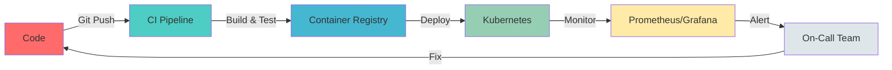

<div align="center">

# 🚀 Welcome to the Cloud Infrastructure Zone

```ascii
╔═══════════════════════════════════════════════════════════════╗
║   _____ _                 _   ____             ___            ║
║  / ____| |               | | |  _ \           / _ \           ║
║ | |    | | ___  _   _  __| | | |_) | ___    | | | |_ __  ___ ║
║ | |    | |/ _ \| | | |/ _` | |  _ < / _ \   | | | | '_ \/ __|║
║ | |____| | (_) | |_| | (_| | | |_) |  __/   | |_| | |_) \__ \║
║  \_____|_|\___/ \__,_|\__,_| |____/ \___|    \___/| .__/|___/║
║                                                    | |         ║
║                                                    |_|         ║
╚═══════════════════════════════════════════════════════════════╝
```

### 👨‍💻 Yousfi Mohamed Amine | Cloud DevOps Engineer | Tunisia 🇹🇳

*"Automating the future, one pipeline at a time"*

</div>

---

## 🎯 Current Mission

```yaml
status: DEPLOYING
project: Cloud-Native Marketplace Platform
focus:
  - Infrastructure as Code (Terraform)
  - Kubernetes Orchestration
  - CI/CD Pipeline Optimization
  - AWS Cloud Architecture
learning_path:
  - Advanced Docker Containerization
  - AWS Solutions Architect Certification
  - GitOps with ArgoCD
  - Service Mesh (Istio)
```

---

## 🛠️ Tech Arsenal

<div align="center">

### ☁️ Cloud Platforms & Infrastructure


### 🐳 Container & Orchestration


### 🔄 CI/CD & Automation


### 📊 Monitoring & Logging


### 💻 Languages & Scripting


### 🗄️ Databases & Storage


### 🔐 Security & Compliance


</div>

---

## 📈 Infrastructure Metrics

<div align="center">

```diff
@@                    System Status                     @@
+ Uptime:           99.9% (Last 30 days)
+ Deployments:      142 successful builds this month
+ Pipeline Speed:   Average build time: 4m 32s
+ Cost Optimization: 23% reduction in cloud spend
+ Security Score:   A+ (Zero critical vulnerabilities)
```


</div>

---

## 🏗️ Architecture Philosophy

<div align="center">



</div>

### 💡 Core Principles

- **🔄 Everything as Code** - Infrastructure, Configuration, and Policy
- **🚢 Immutable Infrastructure** - No snowflakes, only cattle
- **📦 Containerize Everything** - If it runs, it can be containerized
- **🔍 Observability First** - You can't improve what you can't measure
- **🛡️ Security by Design** - Shift-left security at every stage
- **⚡ Automate Repetitive Tasks** - Time is the most valuable resource

---

## 🎓 Certifications & Learning

<div align="center">

| Certification | Status | Date |
|--------------|--------|------|
| 🏆 AWS Solutions Architect Associate | 🎯 In Progress | 2025 |
| 🏆 Certified Kubernetes Administrator (CKA) | 🎯 Planned | 2025 |
| 🏆 HashiCorp Terraform Associate | 🎯 Planned | 2025 |
| 🏆 Docker Certified Associate | ✅ Completed | 2024 |

</div>

---

## 🌐 Connect With Me

<div align="center">

[](mailto:yousfi.amine@esprit.tn)
[](https://linkedin.com/in/amine-yousfi)
[](https://my-portfolio-pi-six-57.vercel.app/)
[](https://twitter.com/yourusername)

</div>

---

## 📊 Contribution Activity

<div align="center">
  


<picture>
  <source media="(prefers-color-scheme: dark)" srcset="https://raw.githubusercontent.com/yourusername/yourusername/output/github-contribution-grid-snake-dark.svg">
  <source media="(prefers-color-scheme: light)" srcset="https://raw.githubusercontent.com/yourusername/yourusername/output/github-contribution-grid-snake.svg">
  
</picture>

</div>

---

## 💬 DevOps Quote of the Day

<div align="center">

> *"The best way to predict the future is to automate it."*
> 
> — Anonymous DevOps Engineer

[](https://github.com/piyushsuthar/github-readme-quotes)

</div>

---

<div align="center">

### 🔧 Quick Stats


**⚡ "Deploying dreams into reality, one commit at a time" ⚡**

</div>
